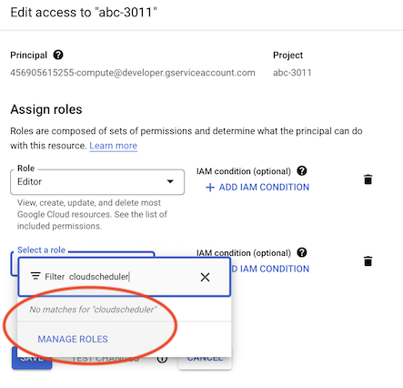

# Problem #2

The `abc` scheduled function is enabled and we try to deploy it.

## Preparation

- Do the steps in the main `README`.

- In Firebase Console (online), make sure there is no existing version of `abc` function:

   - [Firebase Console](https://console.firebase.google.com) > (project) > `Functions`

      If there is an instance, delete it.


## Steps

```
$ ./deploy
...
i  functions: creating Node.js 16 function abc(europe-north1)...
HTTP Error: 403, The principal (user or service account) lacks IAM permission "cloudscheduler.jobs.update" for the resource "projects/abc-3011/locations/europe-north1/jobs/firebase-schedule-abc-europe-north1" (or the resource may not exist).

Functions deploy had errors with the following functions:
	abc(europe-north1)
i  functions: cleaning up build files...

Error: There was an error deploying functions
```

The error message is clear, but the developers may expect `firebase deploy` to make such access rights enabling, automatically. This author thinks it happens for other access rights.


### Expected

- I would see a line such that:

   ```
   functions: IAM role `cloudscheduler.jobs.update` added to [...]
   ```
   
- ...and deployment would succeed

### Actual

(above error message)

### Work-around

- GCP console > (project) > `IAM & Admin` > Principle `4569...-compute@developer.gserviceaccount.com` ("Default compute service account") > `Edit principle`

   >

   >Hmm.. not so easy to know which one is `cloudscheduler.jobs.update`

Actually, based on the 403 error message, I don't know, how I can correct the situation.

= likely there's a manual work-around, but it's not immediately obvious to an engineer working in the Firebase knowledge level.

>Tried that it's not region specific. `"europe-west"` gives the same.


## Why this matters?

The developer experience should be consistent. Part of Firebase brand promise is that we need to steer less technical details than if working on GCP, directly.

`firebase deploy` does this, for many access rights. For consistency, I hope the intention is that it handles things in all cases. Of course, there's no written commitment to this that I know of. Just "it seems to do things for me" - which I feel is the right way for initialization / deployments.

